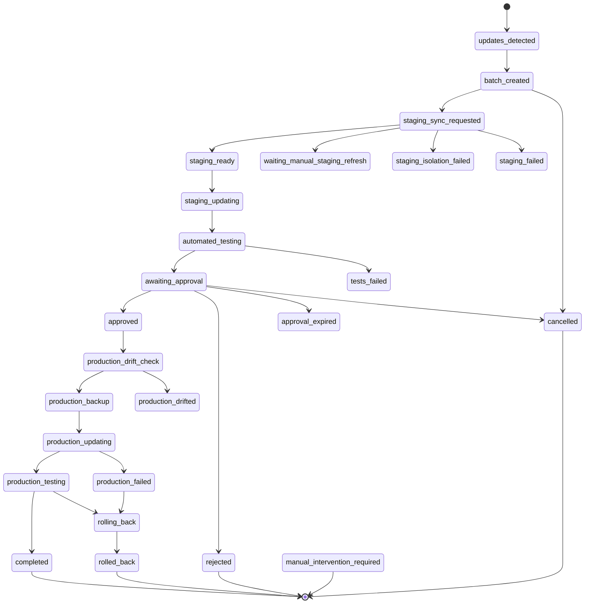

# Staging-First Update Pipeline

> Version 1.0 · Care v1.15.47 · Plugin Center v1.1.59

Actualizaciones inmutables probadas en staging, validación automática, aprobación humana y aplicación segura del mismo lote en producción.

---

## Índice

1. [Resumen de arquitectura](#1-resumen-de-arquitectura)
2. [Estados y transiciones](#2-estados-y-transiciones)
3. [Tablas de base de datos (PC)](#3-tablas-de-base-de-datos-pc)
4. [Endpoints REST](#4-endpoints-rest)
5. [Protocolo de emparejamiento](#5-protocolo-de-emparejamiento)
6. [Detección de entorno clonado](#6-detección-de-entorno-clonado)
7. [Aprobación humana](#7-aprobación-humana)
8. [Artifacts y descarga segura](#8-artifacts-y-descarga-segura)
9. [Rollback](#9-rollback)
10. [Feature flags](#10-feature-flags)
11. [Límites y throttling](#11-límites-y-throttling)
12. [Amenazas y mitigaciones](#12-amenazas-y-mitigaciones)
13. [Operaciones y recuperación](#13-operaciones-y-recuperación)
14. [Cómo añadir un proveedor de staging](#14-cómo-añadir-un-proveedor-de-staging)
15. [Cómo añadir una suite de tests](#15-cómo-añadir-una-suite-de-tests)
16. [Casos manuales documentados](#16-casos-manuales-documentados)
17. [Riesgos conocidos](#17-riesgos-conocidos)

---

## 1. Resumen de arquitectura

```
┌─────────────────────────────────┐
│         Plugin Center (Hub)     │
│                                 │
│  PC_Pipeline          ←─────── Care (producción) polls
│  PC_Command_Queue               PC GET /pipeline/commands
│  PC_Update_Batch                every 5 min via AS
│  PC_Manifest                            │
│  PC_Artifact_Store              │
│  PC_Pairing                     │
└─────────────────────────────────┘
           │ enqueue commands
           ▼
┌─────────────────────────────────┐
│  RP_Care_Pipeline_Client        │
│  RP_Care_Inventory_Snapshot     │
│  RP_Care_Staging_Provider       │
│  RP_Care_Isolation_Checker      │
│  RP_Care_Test_Runner            │
│  RP_Care_Approval_Screen        │
└─────────────────────────────────┘
       │
       │ (staging instance — separated site)
       ▼
┌─────────────────────────────────┐
│  RP_Care_Pipeline_Client        │
│  (environment = staging)        │
└─────────────────────────────────┘
```

### Modelo pull

Care **sondea** a PC cada 5 minutos mediante Action Scheduler. PC nunca empuja webhooks a Care. Esto funciona detrás de Cloudflare, WAF y NAT sin configuración adicional.

### Lote inmutable

Un `PC_Update_Batch` tiene un `manifest_hash` (SHA-256 del JSON canónico del manifiesto). La aprobación humana queda vinculada a ese hash exacto más el hash del inventario de producción en el momento del sondeo. Si cualquiera de los dos cambia, la aprobación se invalida.

---

## 2. Estados y transiciones



### Estados terminales

`completed`, `rejected`, `rolled_back`, `cancelled`, `manual_intervention_required`

Una vez en estado terminal, el lote no puede avanzar. Se debe crear un nuevo lote para reintentar.

### Comparación-y-asignación atómica

`PC_Update_Batch::transition($id, $to)` ejecuta:

```sql
UPDATE wp_pc_update_batches
   SET state = $to, updated_at = NOW()
 WHERE id = $id AND state = $current_state
```

Si la fila no se actualiza (concurrencia, estado incorrecto), la transición falla con `WP_Error`. Esto previene corrupciones concurrentes.

---

## 3. Tablas de base de datos (PC)

| Tabla                     | Propósito                                         |
|---------------------------|---------------------------------------------------|
| `pc_care_site_groups`     | Grupos (un producción + un staging)               |
| `pc_care_instances`       | Instancias Care emparejadas                       |
| `pc_update_batches`       | Lotes de actualización y su estado                |
| `pc_update_batch_items`   | Ítems individuales del lote (plugin/core/theme)   |
| `pc_update_artifacts`     | ZIPs descargados y verificados (SHA-256)           |
| `pc_update_approvals`     | Registro de decisiones de aprobación              |
| `pc_update_commands`      | Cola de comandos HMAC para Care                   |
| `pc_update_events`        | Log de auditoría (append-only)                    |
| `pc_pairing_tokens`       | Tokens de emparejamiento de un solo uso           |

Migración idempotente: `PC_DB_Migrations::run()` en cada carga del plugin; salta si `pc_pipeline_db_version = '1.0.0'`.

---

## 4. Endpoints REST

### PC (Plugin Center) — `replanta-pc/v1`

| Método | Ruta                             | Auth                       | Descripción                            |
|--------|----------------------------------|----------------------------|----------------------------------------|
| GET    | `/pipeline/commands`             | X-Pipeline-Token + X-Instance-ID | Care sondea su siguiente comando  |
| POST   | `/pipeline/command-ack`          | X-Pipeline-Token           | Care confirma ejecución del comando    |
| POST   | `/pipeline/inventory-report`     | X-Pipeline-Token           | Care envía snapshot de inventario      |
| POST   | `/pipeline/batch-status`         | X-Pipeline-Token           | Care notifica cambio de estado         |
| POST   | `/pipeline/batch-approval`       | X-Pipeline-Token           | Aprobación del operador desde Care     |
| POST   | `/pipeline/pairing/generate`     | X-Admin-Token              | Genera token de emparejamiento OTP     |
| POST   | `/pipeline/pairing/consume`      | (el token OTP es el auth)  | Care se registra con el token          |
| GET    | `/pipeline/batch/{id}`           | X-Admin-Token              | Detalles del lote                      |
| POST   | `/pipeline/batch/{id}/state`     | X-Admin-Token              | Override de estado (admin)             |
| GET    | `/pipeline/groups`               | X-Admin-Token              | Lista de grupos                        |

### Care — `replanta-care/v1`

| Método | Ruta                             | Auth          | Descripción                             |
|--------|----------------------------------|---------------|-----------------------------------------|
| GET    | `/pipeline/commands`             | X-Hub-Token   | Dispara poll manual desde Hub           |
| POST   | `/pipeline/command-ack`          | X-Hub-Token   | Reenvía ACK a PC                        |
| POST   | `/pipeline/pairing`              | X-Hub-Token   | Inicia o completa emparejamiento        |
| POST   | `/pipeline/approval-request`     | X-Hub-Token   | Envía decisión de aprobación a PC       |

---

## 5. Protocolo de emparejamiento

### Responsabilidad del propietario y preparacion del staging

El propietario del sitio proporciona una URL exclusiva de staging y la declara en **Care > Configuracion > URL de staging**. Registrar esa URL no crea un clon ni concede acceso al servidor: debe existir una instalacion WordPress funcional en esa direccion.

El procedimiento soportado para un hosting externo es:

1. El cliente o el operador crea el subdominio, su HTTPS y una instalacion clonada desde produccion usando la herramienta del hosting o un proceso manual.
2. Neutraliza indexacion, correo saliente, pagos reales, webhooks, pedidos e integraciones externas.
3. Instala Care en ambos WordPress.
4. Plugin Center crea un grupo de sitio y empareja cada instalacion con credenciales independientes: una como `production` y otra como `staging`.
5. Care y Plugin Center verifican URL canonica, aislamiento y capacidades antes de habilitar el pipeline para ese grupo.

Care no pide ni conserva usuario o contrasena de MySQL para el emparejamiento ni para aplicar lotes. Una URL de staging vacia tampoco puede construirse solo con credenciales de base de datos: clonar WordPress requiere archivos, base de datos, reescritura segura de URLs y controles de aislamiento. Si esas credenciales son necesarias para una clonacion manual, se gestionan fuera de Care mediante el panel o el acceso seguro del hosting.

La instancia subordinada usa las credenciales de pairing del pipeline. No debe validarse como una segunda instalacion comercial con la misma licencia de una plaza ni consumir otro seat; se enlaza al grupo existente desde Plugin Center.

La instalacion de staging debe usar base de datos, cache y credenciales de servicios separadas de produccion. Redis debe estar operativo o desactivado; nunca debe compartir prefijo o base logica con produccion.

```
Operador en PC Admin
    │
    │  POST /pipeline/pairing/generate
    │  { group_id, canonical_url, environment, ttl_seconds }
    │
    ▼
PC genera token (32 bytes random)
  - almacena SHA-256(token) en pc_pairing_tokens
  - TTL configurable (default 3600s)
  - devuelve raw token AL OPERADOR (mostrado una sola vez)
    │
    │  El operador copia el token en la UI de Care
    │
    ▼
Care llama: POST /pipeline/pairing/consume
  { token, canonical_url, instance_id, capabilities }
    │
    ▼
PC verifica:
  - hash(token) == stored_hash ✓
  - canonical_url normalizada == stored ✓
  - not consumed, not expired ✓
  - SSRF check en canonical_url ✓
PC crea credenciales (instance_token, encrypted_secret)
PC marca token como consumido (single-use)
    │
    ▼
Care almacena: instance_id, group_id, environment, encrypted_secret
Care status → READY
```

### Protección SSRF

`PC_Pairing::normalise_url()` rechaza:
- `localhost`, `127.x.x.x`, `::1`
- RFC-1918: `10/8`, `172.16/12`, `192.168/16`
- Link-local: `169.254/16`, `fe80::/10`
- URLs con `userinfo` (user:pass@)
- Esquemas que no sean `http` o `https`

---

## 6. Detección de entorno clonado

En cada boot de WordPress, `RP_Care_Pipeline_Client::maybe_detect_cloned_environment()` compara `home_url()` contra `rpcare_pipeline_canonical_url`.

Si no coinciden (normalización: quita scheme + trailing slash):

1. El estado de emparejamiento pasa a `cloned_environment_quarantine`
2. El poll de comandos se detiene
3. Las actualizaciones directas quedan bloqueadas
4. Un aviso aparece en el admin de WordPress

**Para salir de cuarentena**: el operador debe re-emparejar la instancia desde PC con la URL correcta.

---

## 7. Aprobación humana

### Pantalla de aprobación

`RP_Care_Approval_Screen` registra un submenú en WP Admin visible solo para usuarios con el capability `rpcare_approve_updates` (otorgado automáticamente al rol `administrator` en la primera carga).

La pantalla muestra:
- Resumen del lote (plugins/core a actualizar, versiones)
- Resultados de tests de staging
- URL de staging para revisión manual
- Tiempo restante antes del vencimiento (TTL 48h por defecto)
- Texto legal (no puede modificarse)

### Texto de términos (literal, no modificar)

> El usuario confirma la revisión funcional y autoriza la aplicación del lote mostrado. Esto no debe presentarse como una renuncia general de derechos ni como una exención total de responsabilidad técnica de Replanta.

### Flujo de aprobación

```
Operador en Care Admin
    │
    │  [Aprobar / Rechazar / Solicitar revisión]
    │
    ▼
handle_approval():
  - verifica nonce (rpcare_approve_batch_{batch_id})
  - hash_equals(manifest_hash)
  - hash_equals(production_inventory_hash)
  - verifica TTL
  - registra audit mínimo (user_id, display_name, roles — sin IP completa)
    │
    ▼
send_approval_to_pc():
  POST /pipeline/batch-approval (X-Pipeline-Token)
    │
    ▼
PC::record_approval():
  - guarda en pc_update_approvals
  - si approved → transition → APPROVED
  - si rejected → transition → REJECTED
  - si request_review → queda en AWAITING_APPROVAL
```

### La aprobación es de un solo uso

Una vez registrada `approved` o `rejected`, el estado del lote es terminal o avanza. La misma aprobación no puede usarse para un segundo lote — el `manifest_hash` + `production_inventory_hash` son únicos por lote.

---

## 8. Artifacts y descarga segura

`PC_Artifact_Store` descarga ZIPs de actualización una sola vez:

1. `download_and_store(url, slug, expected_sha256)` es idempotente por SHA-256
2. Almacena fuera del webroot: `PC_ARTIFACT_STORE_DIR` (o `{uploads}/pc-artifacts/`)
3. Protección: `.htaccess deny-all` + `index.php` vacío
4. Permisos: `chmod 0640` por fichero
5. URLs de descarga temporales: HMAC-SHA256 firmadas, TTL 300s
6. `verify_and_get_path()`: verifica firma + expiración antes de devolver la ruta

### Redacción de URLs en logs

`PC_Artifact_Store::redact_url()` elimina parámetros de query que contengan:
`token`, `key`, `secret`, `pass`, `password`, `credential`, `auth`, `access_token`, `api_key`

---

## 9. Rollback

Cuando `production_testing` falla:

1. PC transiciona el lote a `rolling_back`
2. PC encola comando `rollback_batch` a la instancia producción
3. Care ejecuta el rollback usando el backup creado en `production_backup`
4. Al completar: lote → `rolled_back` (terminal)

El rollback **no** es automático para todos los fallos — requiere que el backup de producción se haya completado correctamente (estado `production_backup → production_updating`). Si el backup falló, el estado queda en `manual_intervention_required`.

---

## 10. Feature flags

| Opción / Columna                  | Ámbito   | Tipo     | Descripción                               |
|-----------------------------------|----------|----------|-------------------------------------------|
| `pc_staging_pipeline_enabled`     | WP option | bool    | Toggle global del pipeline en PC          |
| `pipeline_enabled` (columna)      | Grupo DB | tinyint  | Toggle por grupo de sitios                |
| `rpcare_pipeline_enabled`         | WP option | bool    | Toggle en la instancia Care               |
| `rpcare_pipeline_pairing_status`  | WP option | string  | Estado del emparejamiento                 |

**Ambos** `pc_staging_pipeline_enabled` y `pipeline_enabled` del grupo deben estar activos para que el pipeline funcione en ese grupo. El flag legacy `staging_validated=true` no puede autorizar producción cuando el pipeline está habilitado.

---

## 11. Límites y throttling

| Parámetro                  | Valor por defecto | Descripción                                    |
|---------------------------|-------------------|------------------------------------------------|
| Poll interval             | 5 minutos         | `rpcare_task_pipeline_poll` via AS             |
| Command lease             | 120s              | Tiempo máximo para ejecutar un comando         |
| Command max attempts      | 5                 | Tras 5 fallos, el comando queda en `failed`    |
| Max payload               | 32 768 bytes      | `PC_Command_Queue::MAX_PAYLOAD_BYTES`           |
| Replay FIFO               | 200 command IDs   | `RP_Care_Pipeline_Client::MAX_PROCESSED_CMDS`  |
| Approval TTL              | 48 horas          | Configurable por grupo (`approval_ttl_hours`)  |
| Artifact download URL TTL | 300s              | HMAC expiry para descarga temporal             |
| Pairing token TTL         | 3 600s            | Default; personalizable en `generate_token()`  |
| Event context max         | 8 192 bytes       | `PC_Pipeline_Event::MAX_CONTEXT_BYTES`         |

---

## 12. Amenazas y mitigaciones

| Amenaza                             | Mitigación                                                                |
|-------------------------------------|---------------------------------------------------------------------------|
| Replay de comandos                  | FIFO de 200 IDs procesados; `expires_at` en cada comando                  |
| Falsificación de comandos           | HMAC-SHA256 por instancia; secret encriptado con AES-256-CBC en DB        |
| Aprobación de lote incorrecto       | `hash_equals(manifest_hash)` + `hash_equals(production_inventory_hash)`   |
| Entorno clonado ejecutando updates  | Detección de URL canónica; cuarentena automática                          |
| SSRF desde canonical_url            | Bloqueo de RFC-1918, loopback, link-local, userinfo                       |
| Artefactos manipulados              | SHA-256 verificado en descarga y antes de instalar                        |
| URLs de descarga filtradas          | Firmadas con HMAC + TTL 300s; redacción en logs                           |
| Concurrencia en transiciones        | Compare-and-set en SQL (`WHERE state = $current`)                         |
| Aprobación expirada usada           | TTL verificado en `record_approval()`                                     |
| Admin token hardcodeado             | Siempre desde `get_option('pc_license_api_token')`; nunca constante       |

---

## 13. Operaciones y recuperación

### Lote atascado

```bash
# Ver estado actual
GET /wp-json/replanta-pc/v1/pipeline/batch/{id}  (X-Admin-Token)

# Forzar cancelación
POST /wp-json/replanta-pc/v1/pipeline/batch/{id}/state
Body: {"state": "cancelled", "meta": {"reason": "manual_cancel"}}
```

### Instancia en cuarentena

1. Ir a Plugin Center → Grupos → instancia afectada
2. Generar nuevo token de emparejamiento para esa instancia
3. En la instancia Care afectada: Admin → Replanta Care → Pipeline → Re-emparejar
4. Pegar el token nuevo

### Fallo de backup en producción

Si `production_backup` falla antes de comenzar `production_updating`:

1. El lote queda en `production_backup` (no avanza automáticamente)
2. Revisar el sistema de backup (UpdraftPlus / B2 / backup nativo)
3. Una vez resuelto, hacer override manual: `POST /batch/{id}/state {"state": "production_updating"}`

### Limpiar comandos expirados

Los comandos expirados se limpian automáticamente en el poll. Para limpieza manual:

```php
PC_Command_Queue::cleanup_expired(); // (no expuesto por REST; usar WP CLI o admin action)
```

---

## 14. Cómo añadir un proveedor de staging

Implementar `RP_Care_Staging_Provider_Interface`:

```php
class RP_Care_Staging_Provider_MiProveedor
    implements RP_Care_Staging_Provider_Interface {

    public static function is_available(): bool { /* ... */ }

    public function capabilities(): array {
        return [
            'can_create'           => true,
            'can_refresh'          => true,
            'can_verify_isolation' => true,
            'provider_name'        => 'mi_proveedor',
        ];
    }

    public function create_or_refresh(): array|\WP_Error { /* ... */ }
    public function status(): array { /* ... */ }
    public function get_url(): ?string { /* ... */ }
    public function verify_isolation(): array { /* ... */ }
    public function cleanup(): bool|\WP_Error { /* ... */ }
}
```

Registrar en `RP_Care_Staging_Provider::get()` antes del fallback `Manual`:

```php
if ( RP_Care_Staging_Provider_MiProveedor::is_available() ) {
    return new RP_Care_Staging_Provider_MiProveedor();
}
```

---

## 15. Cómo añadir una suite de tests

Implementar `RP_Care_Test_Runner_Interface`:

```php
class RP_Care_Test_Suite_MiSuite implements RP_Care_Test_Runner_Interface {

    public function name(): string { return 'mi_suite'; }

    public function run( array $context ): array {
        // Retorna array de resultados con:
        // [ 'name' => 'check_name', 'ok' => bool, 'severity' => 'ok|warning|critical', 'message' => '...' ]
        return [];
    }
}
```

Registrar en `RP_Care_Test_Runner::register()`:

```php
RP_Care_Test_Runner::register( new RP_Care_Test_Suite_MiSuite() );
```

**Regla de severidad**: `critical` siempre bloquea el pipeline. `warning` permite continuar con alerta. `ok` pasa sin aviso.

---

## 16. Casos manuales documentados

| Caso                                   | Razón                                           | Acción requerida                                          |
|----------------------------------------|-------------------------------------------------|-----------------------------------------------------------|
| WP Staging Free detectado              | API de clonado no disponible en versión gratuita | Operador refresca el clon manualmente y confirma          |
| Sin proveedor de staging               | Sin WPStaging ni staging emparejado              | Operador crea staging manualmente y confirma              |
| Bump de versión mayor de core (x.y→z.y) | Riesgo critical por `assess_risk()`             | Revisión manual antes de aprobar el lote                  |
| Backup de producción fallido           | Sistema de backup no disponible                  | Resolver backup, luego override manual de estado          |
| Instancia en cuarentena                | URL canónica no coincide                        | Re-emparejar con token nuevo                              |
| Approve TTL expirado                   | 48h sin decisión                                | Crear nuevo lote (lote anterior queda en `approval_expired`) |

---

## 17. Riesgos conocidos

| Riesgo                                                        | Probabilidad | Impacto | Mitigación pendiente                                                |
|---------------------------------------------------------------|--------------|---------|---------------------------------------------------------------------|
| WP Staging Pro cambia su action hook `wpstg_create_clone`     | Media        | Bajo    | El proveedor devuelve `manual_required` como fallback               |
| SHA-256 de artifact cambia en CDN entre descarga y verificación | Baja       | Alto    | El ZIP se rechaza; se reintenta la descarga                         |
| Instancia staging inaccesible en el momento del poll          | Media        | Bajo    | Command lease 120s; máximo 5 intentos antes de `failed`             |
| Aprobación por operador con contexto incompleto               | Media        | Medio   | Texto legal en la pantalla; no se puede aprobar sin check visual    |
| Derivación del pipeline vía flag legacy `staging_validated`   | Baja         | Alto    | Verificado en `check_staging_gate()`: pipeline activo bloquea este path |

---

*Última actualización: 2026-08-05 · Replanta Care v1.15.47 · Plugin Center v1.1.59*
